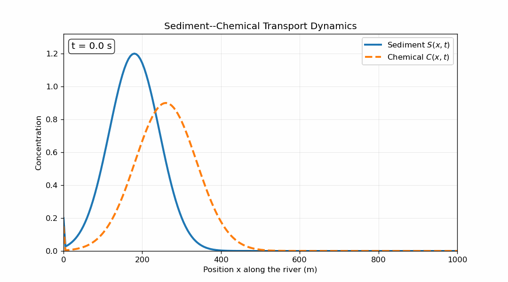

# Sediment–Chemical Transport Animation

A companion visualisation of a coupled sediment–chemical transport study.

The [simulation notebook](https://github.com/Thierrykuatemabap/Partial-Differential-Equation/blob/main/Project%20sediment_chemical.ipynb) contains the model equations, boundary and initial conditions, parameter choices and numerical implementation.

This repository contains the exported GIF. Use the notebook repository to inspect or reproduce the underlying computation.
